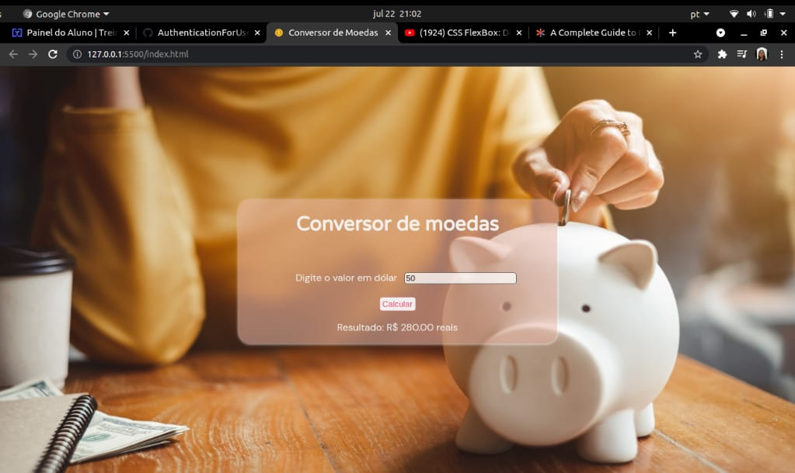

<h1 align="center">Conversor de Moedas</h1>

## Descrição:

Conversor de moedas que converte dólar para real. É um exercício da Imersão Dev da Alura.

## Tecnologias:
  * HTML5
  * CSS3
  * JavaScript

## Projeto:

  

